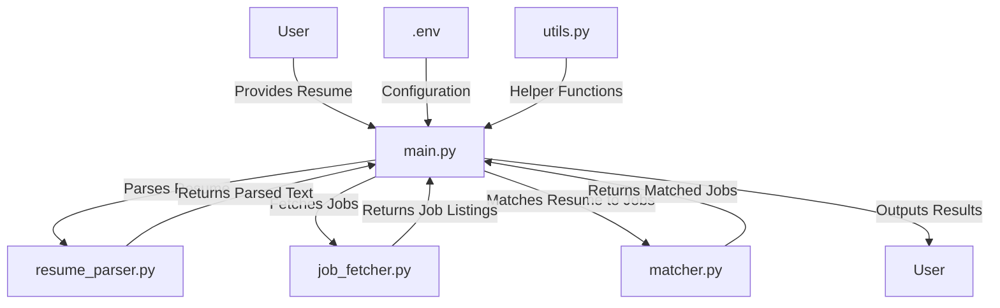

# Job Matcher


A powerful AI-driven tool that matches your resume with remote job listings using semantic similarity analysis. This application helps you find the most relevant job opportunities based on your skills and experience.

## 📋 Overview

Job Matcher uses natural language processing and semantic analysis to:

1. Extract text from your resume (PDF or DOCX format)
2. Fetch job listings from RSS feeds like RemoteOK
3. Compare your resume against job descriptions using semantic similarity
4. Identify your strengths and potential skill gaps for each job
5. Rank jobs by match score and present the top matches

The system employs a modular architecture with a fallback mechanism that works even without advanced ML libraries.

## ✨ Features

- **Resume Parsing**: Extract text from PDF and DOCX resume files
- **Job Fetching**: Fetch and cache job listings from RSS feeds
- **Semantic Matching**: Use state-of-the-art language models to match resumes with jobs
- **Strengths & Gaps Analysis**: Identify your strengths and potential gaps for each job
- **Caching System**: Store job data and results for faster processing
- **Command-Line Interface**: Easy-to-use CLI with multiple options
- **Fallback Mechanism**: Works even without advanced ML libraries

## 🛠️ Installation

### Prerequisites

- Python 3.8 or higher
- pip (Python package installer)

### Setup

1. Clone the repository:
```bash
git clone https://github.com/yourusername/job-matcher.git
cd job-matcher
```

2. Create a virtual environment and activate it:
```bash
python -m venv venv
source venv/bin/activate  # On Windows: venv\Scripts\activate
```

3. Install the required packages:
```bash
pip install -r requirements.txt
```

## ⚙️ Configuration

Create a `.env` file in the project root with the following content (or copy from `.env.example`):

```
# RSS Feed URL for job listings
RSS_FEED_URL=https://remoteok.com/remote-jobs.rss

# Job matching settings
MAX_JOBS=30
TOP_N=5
MODEL_NAME=all-MiniLM-L6-v2

# Path to your resume file (PDF or DOCX)
RESUME_PATH=/path/to/your/resume.pdf

# Data directory for storing cached jobs and results
DATA_DIR=data
```

## 🚀 Usage

### Basic Usage

Run the main script with your resume:

```bash
python main.py
```

This will use the settings from your `.env` file.

### Command Line Options

```bash
# Specify resume path
python main.py --resume /path/to/your/resume.pdf

# Specify RSS feed URL
python main.py --feed https://example.com/jobs.rss

# Specify number of top matches to display
python main.py --jobs 5

# Save results to a file
python main.py --save

# Specify output file
python main.py --output results.json

# Specify configuration file
python main.py --config custom.env
```

### Help

```bash
python main.py --help
```

## 📁 Project Structure

```
job_matcher/
├── src/
│   ├── __init__.py          # Package initialization
│   ├── resume_parser.py     # Resume parsing functionality
│   ├── job_fetcher.py       # Job fetching from RSS
│   ├── matcher.py           # Core matching logic
│   └── utils.py             # Utility functions
├── tests/
│   ├── __init__.py          # Test package initialization
│   ├── test_resume_parser.py # Tests for resume parser
│   ├── test_job_fetcher.py  # Tests for job fetcher
│   └── test_matcher.py      # Tests for matcher
├── data/                    # Data directory (created automatically)
│   ├── cache/               # Cached job data
│   ├── jobs/                # Processed job data
│   ├── resumes/             # Processed resume data
│   └── results/             # Match results
├── main.py                  # Entry point
├── requirements.txt         # Dependencies
├── .env.example             # Example configuration
└── README.md                # Documentation
```

## 🔍 How It Works

### Architecture



### Process Flow

1. **Resume Parsing**: The system extracts text from your resume file (PDF or DOCX).

2. **Job Fetching**: The system fetches job listings from the specified RSS feed and caches them for future use.

3. **Text Processing**:
   - Both resume and job descriptions are split into chunks for better semantic analysis
   - Embeddings are created for each chunk using Sentence Transformers or a fallback method

4. **Matching Algorithm**:
   - Calculates cosine similarity between resume and job description chunks
   - Computes an overall match score based on the top similarities
   - Identifies strengths (resume terms that match well with the job)
   - Identifies gaps (job terms with low match scores)

5. **Result Presentation**:
   - Jobs are ranked by match score
   - Top matches are displayed with score, strengths, and gaps
   - Results can be saved to a JSON file for further analysis

## 🧪 Testing

Run the test suite to ensure everything is working correctly:

```bash
# Run all tests
python -m unittest discover

# Run specific test file
python -m unittest tests.test_resume_parser
```

## 📦 Dependencies

- **feedparser**: For parsing RSS feeds
- **python-docx**: For extracting text from Word documents
- **PyPDF2**: For extracting text from PDF files
- **sentence-transformers**: For creating embeddings and calculating similarities
- **python-dotenv**: For loading environment variables
- **torch**: Required by sentence-transformers
- **tqdm**: For progress bars
- **pytest**: For testing

## 🤝 Contributing

Contributions are welcome! Please feel free to submit a Pull Request.

1. Fork the repository
2. Create your feature branch (`git checkout -b feature/amazing-feature`)
3. Commit your changes (`git commit -m 'Add some amazing feature'`)
4. Push to the branch (`git push origin feature/amazing-feature`)
5. Open a Pull Request

## 📄 License

This project is licensed under the MIT License - see the LICENSE file for details.

## 🙏 Acknowledgements

- [Sentence Transformers](https://www.sbert.net/) for providing the embedding models
- [RemoteOK](https://remoteok.com/) for their job listings RSS feed
- All open-source libraries used in this project 